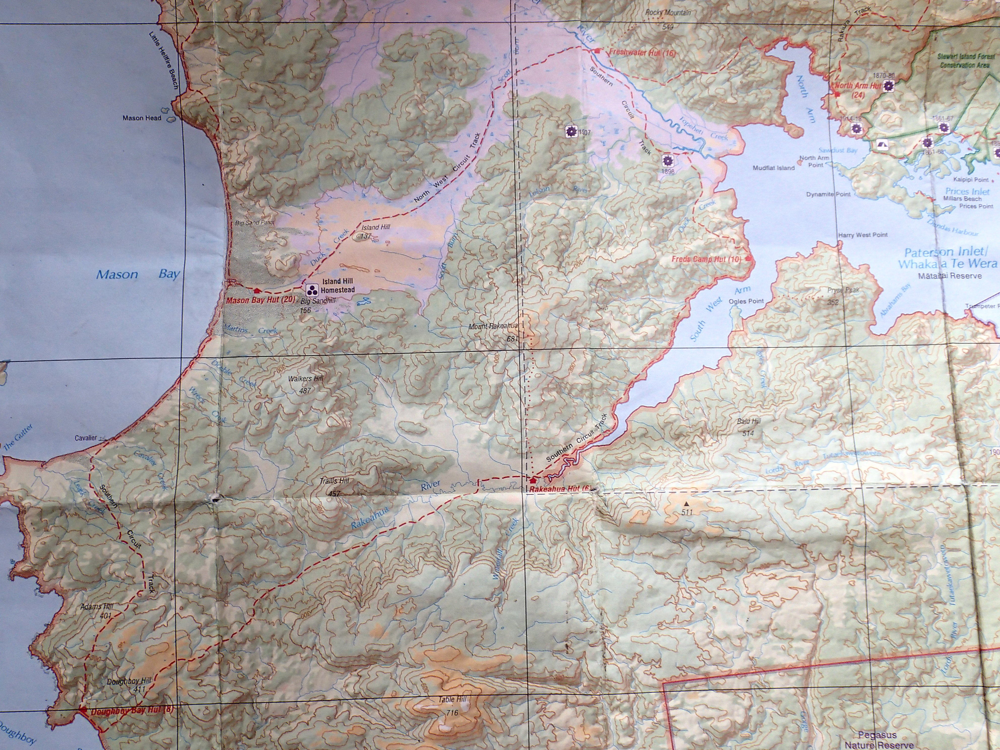
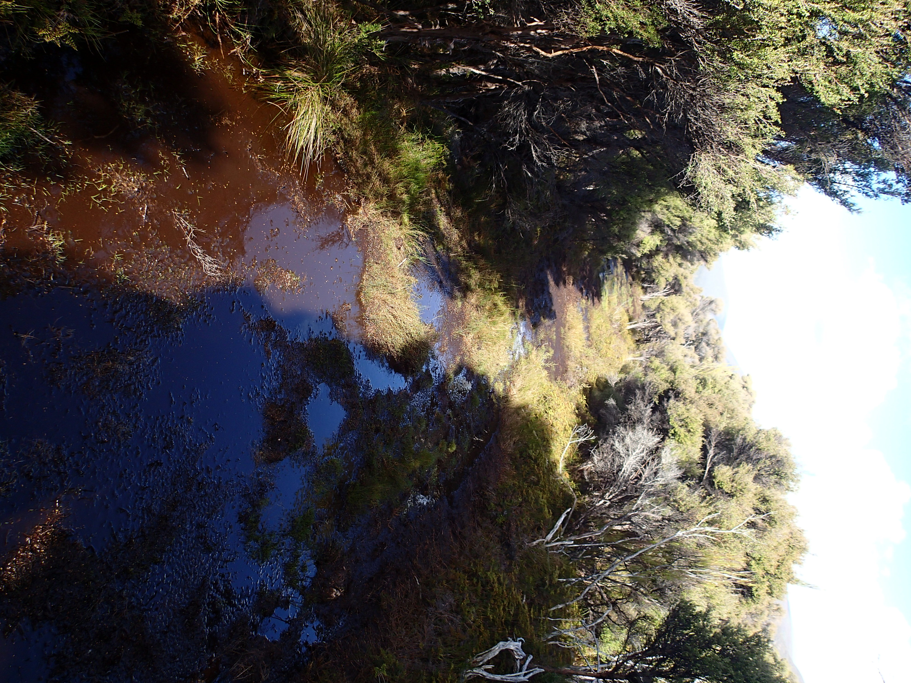

# Stewart Island February 2017

We went to Stewart Island.  It was fun.

Here is an [interactive map](leaflet.html).

First we did this walk:

## We walked along the beach:

<iframe width="560" height="315" src="https://www.youtube.com/embed/gRuqnMsnB_o" frameborder="0" allowfullscreen></iframe>

## And we saw a kiwi:

<iframe width="560" height="315" src="https://www.youtube.com/embed/iOxU1d3IbII" frameborder="0" allowfullscreen></iframe>

## At one point there was some mud.

It was fun.

