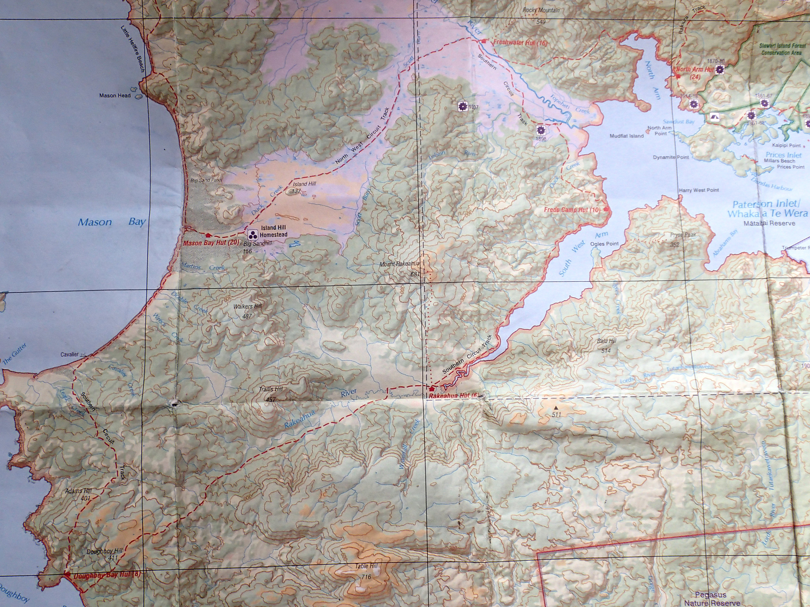
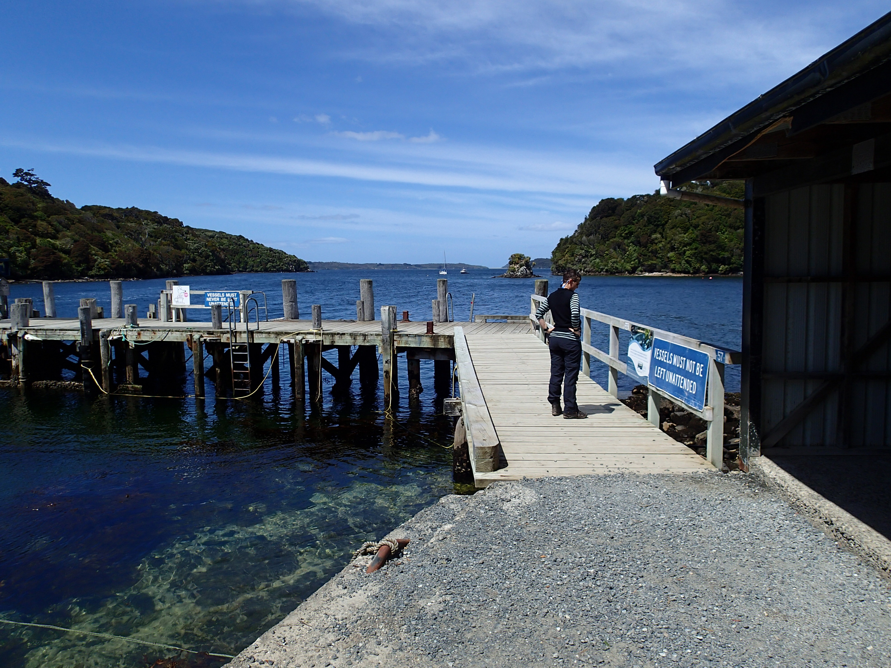
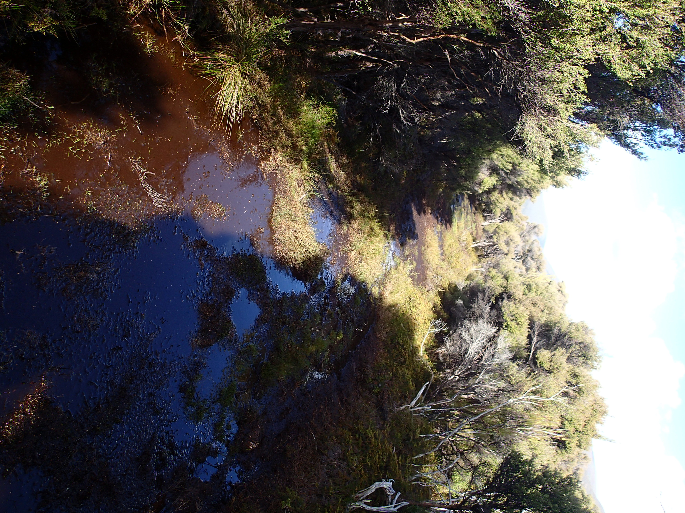

# Overview

##

## Elevation

By New Zealand standards, it's pretty light on for hills; but it turns out the quality of the track makes up for it.  400 metres of vertical height is nothing by Tararua standards, but it counts when you're bashing through mud and underrowth.

## Interactive map

<iframe width="800" height="450" src="leaflet.html" frameborder="0" allowfullscreen></iframe>

Click on the markers for pictures and movies; or try the [full screen version](leaflet.html)/

# Day 1

##

##

##

##

##

##

##

##

##

# Day 2 

##

##

##

##

##

##

##

##

##

##

# Day 3

##

##

##

##

##

##

##

##

##

##

##

##

